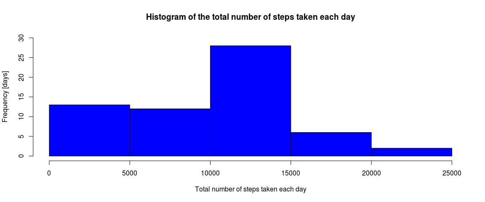
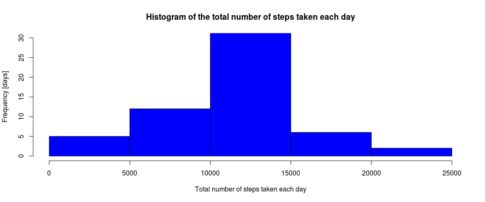
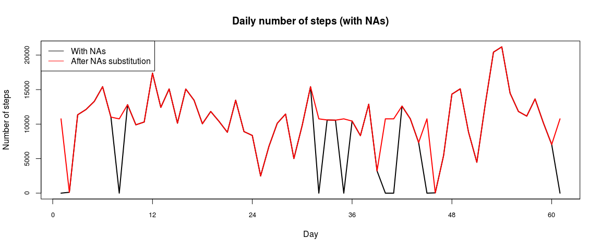
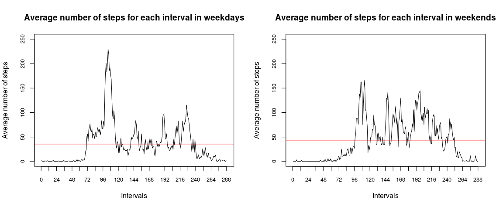

# Reproducible research - week 2 assignment
Francesco Chiaveri  
September 7, 2017  


##1. Load and pre-processing data

Downloading and reading the dataset in csv format (17568 obs. of 3 variables):


```r
setwd("~/Desktop/Coursera/Reproducible Research/w2 Reproducible research_peer-graded assignment")
url = "https://d396qusza40orc.cloudfront.net/repdata%2Fdata%2Factivity.zip"
if(!file.exists("Activity_monitoring_data.zip")){
        download.file(url, "Activity_monitoring_data.zip")
}
unzip(zipfile = "Activity_monitoring_data.zip")
db = read.csv("activity.csv")
str(db)
```

```
## 'data.frame':	17568 obs. of  3 variables:
##  $ steps   : int  NA NA NA NA NA NA NA NA NA NA ...
##  $ date    : Factor w/ 61 levels "2012-10-01","2012-10-02",..: 1 1 1 1 1 1 1 1 1 1 ...
##  $ interval: int  0 5 10 15 20 25 30 35 40 45 ...
```

Transforming the class of the "interval" variable from integer to factor for further calculations:


```r
db$interval=as.factor(db$interval)
str(db)
```

```
## 'data.frame':	17568 obs. of  3 variables:
##  $ steps   : int  NA NA NA NA NA NA NA NA NA NA ...
##  $ date    : Factor w/ 61 levels "2012-10-01","2012-10-02",..: 1 1 1 1 1 1 1 1 1 1 ...
##  $ interval: Factor w/ 288 levels "0","5","10","15",..: 1 2 3 4 5 6 7 8 9 10 ...
```

##2. What is mean total number of steps taken per day?

Calculating the total number of steps taken per day:


```r
steps_table = tapply(db$steps, db$date, sum, na.rm = TRUE)
head(steps_table)
```

```
## 2012-10-01 2012-10-02 2012-10-03 2012-10-04 2012-10-05 2012-10-06 
##          0        126      11352      12116      13294      15420
```

Making an histogram showing in how many days the subject reached different levels of steps:


```r
hist(steps_table, 
     main = "Number of days in which the subject reached different steps milestones",
     xlab = "Step classes [count]",
     ylab = "Number of days [days]",
     ylim = c(0, 30),
     col = "blue"
        )
```

<!-- -->

Calculating the mean and the median of the total number of steps taken per day:


```r
steps_mean = mean(steps_table, na.rm = TRUE)
steps_median = median(steps_table, na.rm = TRUE)
steps_mean
```

```
## [1] 9354.23
```

```r
steps_median
```

```
## [1] 10395
```

##3. What is the average daily activity pattern?

Making a time series plot of the 5-minute interval (x-axis) and the average number of steps taken, averaged across all days (y-axis). In 1 day there are 288 intervals of 5 minutes (288*5 = 1440 minutes / day). 12 intervals are 1 hour


```r
avg_step_interval = tapply(db$steps, db$interval, mean, na.rm = TRUE)
plot(avg_step_interval,
     main = "Average number of steps for each interval",
     type = "l",
     cex.axis = 0.8,
     xaxp = c(0, 288, 24),
     ylab = "Average number of steps",
     xlab = "Intervals"
     )
```

<!-- -->

Finding the interval of the max average step:


```r
max_index = which.max(avg_step_interval)
max_index
```

```
## 835 
## 104
```

Max is in interval 835 (104th interval of the day)

##4. Imputing missing values

Calculating the total number of missing values in the dataset


```r
Number_NAs = table(is.na(db$steps))
Number_NAs
```

```
## 
## FALSE  TRUE 
## 15264  2304
```

There are 2304 missing values in the step variable. With the following chunk a new dataset is created substituting Nas in the steps variable with the average number of steps happening in the same interval calculated in the other days where steps is not NA:


```r
NA_rows = is.na(db$steps)
NA_intervals = db$interval[NA_rows]
NEW_steps = avg_step_interval[as.character(NA_intervals)]

db_complete = db
db_complete$steps[is.na(db_complete$steps)==TRUE] = round(NEW_steps)
db_complete$steps = as.integer(db_complete$steps)
```

Making an histogram showing in how many days the subject reached different levels of steps after having substituted the NAs in the steps variable:


```r
steps_table_complete = tapply(db_complete$steps, db_complete$date, sum, na.rm = TRUE)
head(steps_table_complete)
```

```
## 2012-10-01 2012-10-02 2012-10-03 2012-10-04 2012-10-05 2012-10-06 
##      10762        126      11352      12116      13294      15420
```

```r
hist(steps_table_complete, 
     main = "Number of days in which the subject reached different steps milestones",
     xlab = "Step classes [count]",
     ylab = "Number of days [days]",
     ylim = c(0, 30),
     col = "blue"
        )
```

<!-- -->

Calculating the mean and the median of the total number of steps taken per day after substituting the NAs in the steps variable:


```r
steps_mean_complete = mean(steps_table_complete, na.rm = TRUE)
steps_median_complete = median(steps_table_complete, na.rm = TRUE)
round(c(steps_mean, steps_mean_complete))
```

```
## [1]  9354 10766
```

```r
c(steps_median, steps_median_complete)
```

```
## [1] 10395 10762
```

The principal difference from the dataset with NAs is that both mean and median are higher than before. In particular in the following plot you can see that few days completely NA have been removed:


```r
par(mfrow = c(1,1))

plot(steps_table,
     main = "Daily number of steps (with NAs)",
     type = "l",
     lwd = 2,
     cex.axis = 0.8,
     xaxp = c(0, 288, 24),
     ylab = "Number of steps",
     xlab = "Day"
     )

points(steps_table_complete,
       type = "l",
       col = "red",
       lwd = 2
     )

legend("topleft", legend = c("With NAs", "After NAs substitution"), col = c("black", "red"), lty = 1)
```

<!-- -->


##4. Are there differences in activity patterns between weekdays and weekends?

Creating new variable in the complete dataset, the day of the week and the type of day (weekday or weekend)


```r
db_complete$date = as.Date(db_complete$date, "%Y-%m-%d")
db_complete$day = weekdays(db_complete$date)
db_complete$daytype[db_complete$day == "sabato" | db_complete$day == "domenica"] = "weekend"
db_complete$daytype[db_complete$day != "sabato" & db_complete$day != "domenica"] = "weekday"
db_complete$daytype = as.factor(db_complete$daytype)
```

Making a panel plot containing a time series plot of the 5-minute interval (x-axis) and the average number of steps taken, averaged across all weekday days or weekend days (y-axis).


```r
avg_step_interval_weekday = tapply(db_complete$steps[db_complete$daytype == "weekday"], db$interval[db_complete$daytype == "weekday"], mean, na.rm = TRUE)
avg_step_interval_weekend = tapply(db_complete$steps[db_complete$daytype == "weekend"], db$interval[db_complete$daytype == "weekend"], mean, na.rm = TRUE)

par(mfrow = c(1,2))

plot(avg_step_interval_weekday,
     main = "Average number of steps for each interval in weekdays",
     type = "l",
     cex.axis = 0.8,
     xaxp = c(0, 288, 24),
     yaxp = c(0, 250, 5),
     ylim = c(0, 250),
     ylab = "Average number of steps",
     xlab = "Intervals"
     )

abline(h = mean(avg_step_interval_weekday), col = "red")

plot(avg_step_interval_weekend,
     main = "Average number of steps for each interval in weekends",
     type = "l",
     cex.axis = 0.8,
     xaxp = c(0, 288, 24),
     yaxp = c(0, 250, 5),
     ylim = c(0, 250),
     ylab = "Average number of steps",
     xlab = "Intervals"
     )

abline(h = mean(avg_step_interval_weekend), col = "red")
```

<!-- -->

During the weekend steps are more distributed during the day than in the rest of the week; moreover on average during the weekend the subject walks more (see the horizontal red line) 

-

